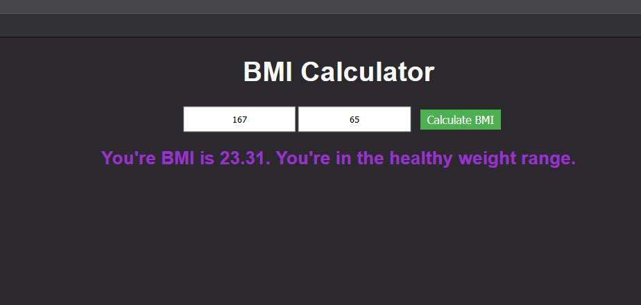

# BMI-Calculator

 A simple BMI calculator built on javscript which takes the input of Height(cm) and Weight in (kg)
 The entire code exists in the **main.js** file 

## Adding the input field parameters
The main input fields that are required to calculate the BMI are the height and weight of the person.
We need to add a text input field on the **index.html** first to display it on the webpage then create the
**document.query()** tag on the main.js file
